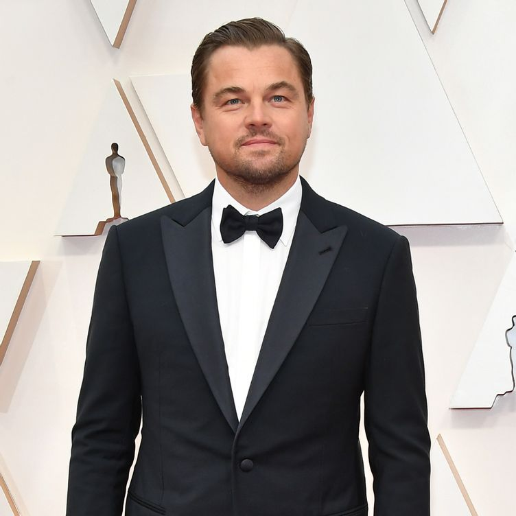
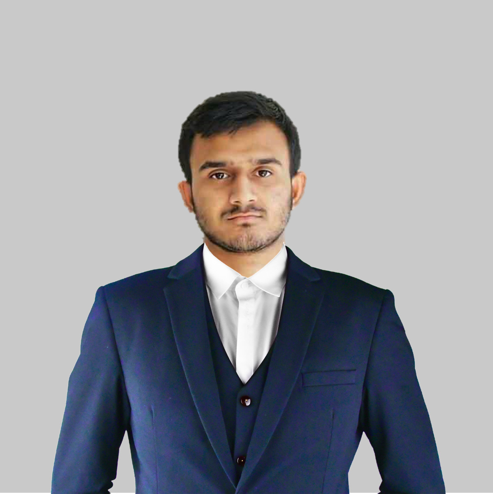

# **Image Manipulation (ID Card) Automation**

## **Project  Information** :
- Copyright : **[Azmine Toushik Wasi](https://azminewasi.github.io/)**
- Owner : **[Azmine Toushik Wasi](https://azminewasi.github.io/)**
- Working Principle:
  - It first loads the image. 
  - Detects face using OpenCV.
  - Adjusts the face with some free space and crops it.
  - Loads the template, places everything accordingly.
  - Saves as both image and pdf file.

---
# **Working Example**
The working example is demonstracted using [10 Minute School](https://10minuteschool.com/) ID Card template.

---

## **Information** in `Database.xlsx` file
| Name                | id      | Designation        |
|---------------------|---------|--------------------|
| Azmine Toushik Wasi | 03.png | Project Executive  |
| Leonardo Dcaprio    | 02.jpeg | Project Manager    |
| Lal Singh Chadda    | 01.png | Project Executive  |

---

## **Frame and Input Images**
<p float="left">




</p>

---

## **Designed ID  Cards**
<p float="left">


</p>

---
 ***Do not use without permission.***

---

# **How to use (Procedure)**

- Collect dataset file as `Database.xlsx`
- collect images and put them in `./images/`
- Set database and column information
```
form = pd.read_excel("Database.xlsx")
name_list = form['Name'].to_list()
id_list=form['id'].to_list()
designation_list=form['Designation'].to_list()
total = len(name_list)
```
- Collect fonts and put them in `./font/`, and set font locations.
```
font = ImageFont.truetype("./font/Poppins-Medium.ttf", 38)  
font2 = ImageFont.truetype("./font/Poppins-Regular.ttf", 24)

```
- Load base image
```
im = Image.open("0BaseFrame.png")
```
- Set heights and positions of texts.
```
MAX_H2,MAX_W2 = 1004,651
current_h2, pad2 = 270, 5
```
- Change image pasting location if necessary.
```
saveimg.paste(person_nBG, (0,353),person_nBG)
```
- Run `main.py`.

---

 ***Do not use without permission.***

---
# Developed by [***Azmine Toushik Wasi***](https://azminewasi.github.io/)
*Machine Learning Researcher | Exploring Machine Learning & Data Science | Kaggle Notebooks Grandmaster | Tech Writer | Reader*

---
## Get Connected :
- Linkedin : https://www.linkedin.com/in/azminewasi/
- GitHub: https://github.com/azminewasi

---
 ***Do not use without permission.***

---